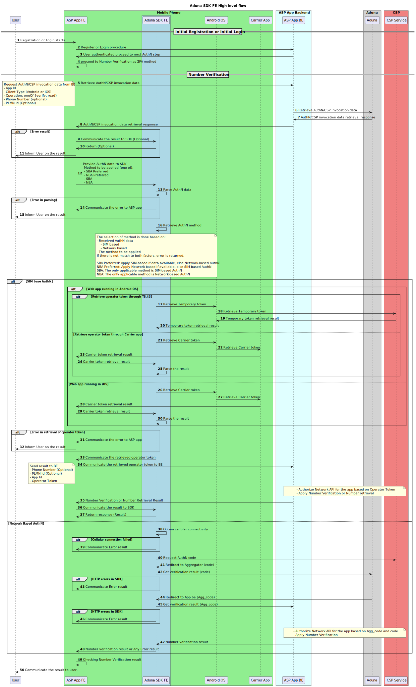

# sdk-nv2-asp-web  
# ADUNA ASP NV2 SDK  

A web SDK (*.tgz) for verifying a user’s phone number using CAMARA Number Verification (NV2), supporting both SIM-based and network-based authentication flows.  
In this document, **“Aduna ASP SDK”** is referred to as the **“SDK.”**

---

## Contents  
1. [Features](#features)  
2. [Flow Overview](#flow-overview)  
3. [Development Requirements](#development-requirements)  
4. [Compatibility](#compatibility)  
5. [Terminology](#terminology)  
6. [Installation](#installation)  
7. [Invocation Data](#invocation-data)  
8. [ASP App Configuration Methods for Handling Invocation Data](#asp-app-configuration-methods-for-handling-invocation-data)  
9. [Quick Start](#quick-start)  
10. [Public Notice](#public-notice)  
11. [Privacy & Data Handling](#privacy--data-handling)  
12. [Support & Contact](#support--contact)  
13. [Versioning](#versioning)  
14. [License](#license)  

---

## Terms used in this document
The following terms are used throughout this document to describe key concepts and components of the SDK.

**Invocation data**: Data received by Aggregator (Aduna) through ASP Backend which invoke the SDK and are needed to determine which method should be performed, i.e. a Network Based Authentication or SIM based Authentication.

**SIM Based Authentication method**: A verification method that uses the device’s SIM card to confirm the user’s phone number.

**Network Based Authentication method**: A verification method that relies on network-level checks to confirm the user's identity. It requires active cellular connection.

**ASP app or App**: The application that utilizes this SDK.

---

## Abbreviations  

- **ASP**: Application Service Provider (host application integrating the SDK)
- **AuthN**: Authorization
- **CSP**: Communication Service Provider  
- **NV2**: CAMARA Number Verification v2  
- **OS**: Operating System  
- **SDK**: Software Developer Kit
- **SIM**: Subscriber Identity Module  

---

## Features  

### General  

- Seamless phone number-verification and device-phone-number retrieval based on CAMARA Number Verification version 2 standards  
- Supports SIM-based authorization flow  
- Supports network-based authorization flow  
- Initialize the SDK with the preferred authorization method  
- Perform authorization based on the selected method and invocation CSP data  
- Automatic fallback between SIM-based and network-based verification  
- Returns the verification result or initiates the CSP verification flow when required 

> [!Note]
>Network-based AuthN method consumes cellular data, only if enabled by the user.

---

## Flow Overview  

For number verification (or retrieving a phone number), the following generic steps are involved:

- Retrieve invocation AuthN data  
- Retrieve the operator’s token or AuthN code and complete number verification  

The following flow represents the end-to-end (E2E) flow for CAMARA Number Verification:



---

### Retrieve Invocation AuthN Data  

After setting up the basic authorization/authentication procedures, this step is optional for the ASP app.  
The ASP app starts the number verification procedure and specifies the desired authorization method to the SDK.

The selected authorization method can be one of the following:

- **SBA preferred**: Prefer SIM-based AuthN; fall back to network-based AuthN  
- **NBA preferred**: Prefer network-based AuthN; fall back to SIM-based AuthN  
- **SBA**: Use SIM-based AuthN only  
- **NBA**: Use network-based AuthN only  

After SDK initialization, the ASP app requests AuthN data from the ASP BE.  
The ASP app receives the following information:

- SIM-based AuthN data (optional)  
- Network-based AuthN data (optional)  

> Note: These data are part of CSP information registered in Aduna.

The SDK selects the authorization method based on:

- The authorization method selected by the ASP app  
- The data received from the ASP BE  
- The device status (especially when network-based AuthN is considered)  

The result of this selection is either:
- SIM-based AuthN (SBA), or  
- Network-based AuthN (NBA)  

---

### Retrieve Operator Token or AuthN Code and Complete Verification  

The flow depends on the authorization method selected by the SDK and the operating system.

---

#### SIM-Based Authorization (SBA) — Android  

1. The SDK parses the invocation CSP data and extracts `simBasedAuthNData`  
2. The SDK interacts with the Android OS (Credential Manager)  
3. The Credential Manager communicates via TS.43 with the CSP entitlement server  
4. A temporary token is retrieved  
5. Android provides the temporary token to the SDK  
6. The SDK returns the result to the ASP app  
7. The ASP app sends the result to the ASP BE  
8. The ASP BE performs API authorization and number verification/retrieval  
9. The result is returned to the ASP app  
10. The ASP app updates the SDK and the user  

---

#### SIM-Based Authorization (SBA) — iOS  

1. The SDK parses the invocation CSP data and extracts `simBasedAuthNData`  
2. The SDK opens a carrier/app URL  
3. The user completes verification externally and a carrier token is generated  
4. The app receives a callback URL  
5. The SDK parses the callback URL and returns query parameters to the ASP app  

> Note: SIM-based authentication involves leaving the app and returning via a deep link callback. The ASP app must handle this callback and resume the flow.

6. The ASP app sends the result to the ASP BE  
7. The ASP BE performs API authorization and number verification/retrieval  
8. The result is returned to the ASP app  
9. The ASP app updates the SDK and the user  

---

#### Network-Based Authorization (NBA) — Any OS  

1. The SDK parses the invocation data and extracts `networkBasedAuthNData`  
2. SDK performs HTTP GET request over cellular network towards carrier
3. Carrier validates the request and returns authorization data through HTTP redirection
4. Redirection to Aggregator
5. Redirection to ASP backend. Verify API authorization and number verification.
6. Phone number is verified by Carrier and SDK receives the response
7. SDK returns verification result to the ASP app

---

## Development Requirements  

- TypeScript version 5.9.3  
- npm CLI 11.4.2  

---

## Compatibility  

This SDK version is compatible with the following Aduna and CAMARA API releases:

| API                 | Release/Version | Reference |
|---------------------|-----------------|----------|
| **Aduna APIs**      |                 |          |
| Authorization APIs  | v1.4.0          |          |
| **CAMARA APIs**     |                 |          |
| Number Verification | r3.2 / v2.1     | [Camara GitHub](https://github.com/camaraproject/NumberVerification/blob/r3.2/code/API_definitions/number-verification.yaml) |


---

## Installation  

- Download or clone the repository  
- In the SDK folder, run: `npm build`  
- After building, run: `npm pack` to generate a `.tgz` file  
- In your main project, take the following steps:
    Step 1: Install the SDK
      ```bash
      npm install <file_path>.tgz
      ```
    Step 2: Create the Injection Token
      Create a file named sdk.token.ts:
      ```typescript
      import { InjectionToken } from '@angular/core';
      import { AdunaNv2AspWebSdkClient } from 'adunanv2aspwebsdk';

      export const ADUNA_SDK = new InjectionToken<AdunaNv2AspWebSdkClient>('ADUNA_SDK');
      ```
    Step 3: Register the SDK Provider
      In your main.ts (or wherever you configure global providers), add:
      ```typescript
      import { ADUNA_SDK } from 'src/sdk.token';
      import { AdunaNv2AspWebSdkClient } from "adunanv2aspwebsdk";
      ```
    Step 4: Use the SDK in a Component
      In the component where you want to use the SDK:

      Imports
      ```typescript
      import { Inject } from '@angular/core';
      import { AdunaNv2AspWebSdkClient } from 'adunanv2aspwebsdk';
      import { ADUNA_SDK } from 'src/sdk.token';
      ```

      Inject in Constructor
      ```typescript
      constructor(
        @Inject(ADUNA_SDK) private sdk: AdunaNv2AspWebSdkClient
      ) {}
      ```
    Step 5: Call SDK Methods
      You can now use the SDK in your component:
      ```typescript
      const result = await this.sdk.analyzeUrl(params);
      ```

---

## Invocation Data  

ASP app needs to invoke ASP BE in order to get the invocation data. The following data could be part of the ASP app request
depending on their availability in Frontend or Backend.

- App ID  
- Client type (iOS or Android)  
- Requested operation (e.g., verify)  
- Phone number (optional)  
- PLMN ID (optional; automatically provided by Android OS when available)  

Refer also to SDK for ASP BE.

The SDK expects invocation data in JSON format:

```json
{
  "simBasedAuthNData": {
    "iOSAppClipUrl": "...",
    "appInfoJwt": "...",
    "appInfoJwtQueryParameterName": "...",
    "appCallbackQueryParameterName": "..."
  },
  "networkBasedAuthNData": {
    "url": "..."
  }
}
```

> Note: `simBasedAuthNData` and `networkBasedAuthNData` are optional depending on carrier configuration.

---

## ASP App Configuration Methods for Handling Invocation Data  

The following configuration methods are supported:

- **SBA Preferred (SBAF)**: Use SBA if available; otherwise fallback to NBA  
- **SBA**: Use only SBA  
- **NBA Preferred (NBAF)**: Use NBA if available; otherwise fallback to SBA  
- **NBA**: Use only NBA  

---

## Quick Start  

### SDK Method Selection  

```typescript
try {
  const sdkResult = await this.sdk.methodSelection(invocationUrlResponse, sav);

  if ('invocationUrlSuccessfullyParsed' in sdkResult) {
    return;
  }

  if (!sdkResult || !sdkResult.mode) {
    this.showErrorMessage('No invocation data! (missing mode)');
    return;
  }

  switch (sdkResult.mode) {
    case 'sba':
      this.sbaActions(sdkResult.invocationUrl);
      break;

    case 'nba':
      this.nbaActions(sdkResult);
      break;

    default:
      this.showErrorMessage('No invocation data! (unknown mode)');
  }

} catch (error: any) {
  console.log("ERROR", error);

  const isSdkError = error && 'error' in error && 'errorDescription' in error;

  if (isSdkError) {
    if (
      error.error === 'nv_error' ||
      error.error === 'nba_error' ||
      error.error === 'sba_error'
    ) {
      this.showErrorMessage(this.genericErrorMessage);
    } else {
      this.showErrorMessage(error.errorDescription || 'SDK error');
    }
  } else {
    this.showErrorMessage(this.genericErrorMessage);
  }
}
```

---

### NBA Handling  

```typescript
nbaActions(result: any) {
  if (typeof result.sdkResult.devicePhoneNumber === 'string')
    // proceed to successful login
  } else {
    // handle the negative case
  }
}
```

---

### SBA Handling  

```typescript
sbaActions(response: string) {
  if (this.isMobile) {
    this.sendToAggregator(response);
  }
}
```

---

## Handling Callback (iOS SBA)  

```typescript
ngOnInit() {
  const analyzeUrl = this.sdk.analyzeUrl(params);

  if (analyzeUrl && 'error' in analyzeUrl && 'errorDescription' in analyzeUrl) {
    if (analyzeUrl.error === "user_activity") {
      this.showErrorMessage(analyzeUrl.errorDescription);
    }
    return;
  }

  if (analyzeUrl && 'appCallbackQueryParameter' in analyzeUrl) {
    if (analyzeUrl.appCallbackQueryParameter) {
      try {
        this.sendToAggregator(analyzeUrl.appCallbackQueryParameter);
      } catch (err) {
        console.error('Failed to parse data param:', err);
      }
    }
  }
}
```

---

## Cleanup  

```typescript
this.sdk.cleanLocalStorage();
```

---

## Cancellation  

```typescript
proceedWithCancel() {
  this.sdk.cleanLocalStorage();
  this.verificationDialog = false;
  this.router.navigate(['/landing']);
}
```

---

## Public Notice  

This SDK is source-available and maintained by Aduna. Code contributions and GitHub issue submissions are not accepted.

---

## Privacy & Data Handling  

- No personal data is stored persistently by the SDK  
- All communication is controlled by the hosting application  

---

## Support & Contact  

Support is provided on a **best-effort basis**.

---

## License  

See the **“Aduna ASP SDK Software License Agreement.pdf”** for details.